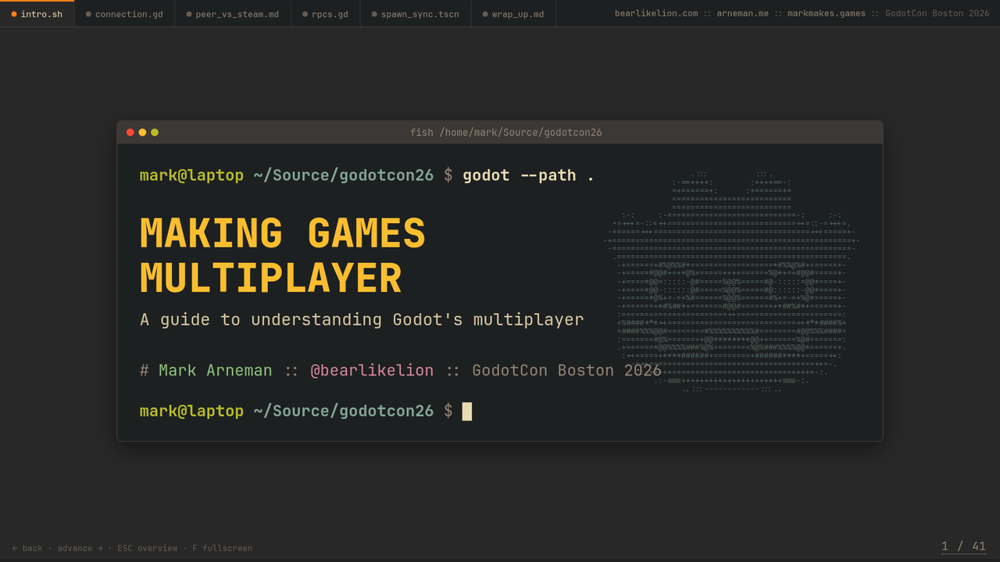

# Making Games Multiplayer

Slides for my GodotCon Boston 2026 talk: a guide to understanding Godot 4's high-level multiplayer, taught through [Cooties](https://github.com/bearlikelion/cooties), an open source (MIT) multiplayer game of tag built in a single 16-hour sprint.



## Viewing the deck

The whole presentation is one self-contained HTML file styled like a gruvbox terminal and the Godot script editor:

1. Grab `cooties-godotcon26.html` (plus `cooties_clips.mp4`, `covino.mp4`, and `godot_valve.mp4` if you want the videos)
2. Keep them in the same folder and double-click the html

It runs fully offline in any browser. Arrow keys advance, `ESC` shows the overview grid, `F` goes fullscreen, and the section tabs along the top are clickable. For a PDF, open the file with `?print-pdf` appended to the URL in Chrome and print.

## What's inside

- 41 slides covering connections (ENet vs Steam), peer IDs vs Steam IDs, RPCs, MultiplayerSpawner and authority, MultiplayerSynchronizer, and interpolation
- Every code slide is rendered from the real Cooties source, verbatim, with true line numbers in a Godot-editor-style panel
- Popup notes step through the code line by line as you advance
- reveal.js, JetBrains Mono, and all images are inlined into the single file

## Building it yourself

The deck is generated by a small pipeline in [`presentation/`](presentation/):

```
python presentation/gdhl.py extract   # copy snippets from the Cooties repo
python presentation/gdhl.py render    # syntax-highlight them into editor panels
python presentation/build.py          # assemble the single-file deck
```

`presentation/dev.py` serves a live-reload dev server at `localhost:8137` that rebuilds on save. See [`presentation/README.md`](presentation/README.md) for the details.

| Path | What it is |
| --- | --- |
| `cooties-godotcon26.html` | The deck, ready to present |
| `presentation/deck-src.html` | Authoring source (slides, styles, JS) |
| `presentation/gdhl.py` | GDScript to gruvbox HTML highlighter |
| `presentation/build.py` | Inlines everything into the single file |
| `presentation/dev.py` | Live-reload dev server |
| `*.mp4` | Videos loaded from disk beside the html |

## Links

- [Cooties on GitHub](https://github.com/bearlikelion/cooties) :: [Cooties on itch.io](https://bearlikelion.itch.io/cooties)
- [SurfsUp on Steam](https://store.steampowered.com/app/3454830/SurfsUp/)
- [godot-box3d](https://github.com/bearlikelion/godot-box3d), contributors wanted!
- [bearlikelion.com](https://bearlikelion.com) :: [markmakes.games](https://markmakes.games)

Cooties itself is MIT licensed. Meme images in the deck belong to their respective owners and are used here in the time-honored tradition of conference talks.
